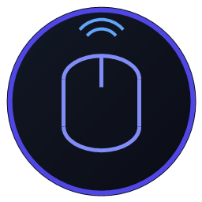

# 📱 PC Remote Controller

Легковесный, высокоскоростной программный комплекс под ОС Windows, позволяющий удаленно управлять компьютером с любого смартфона (iOS / Android) через стандартный мобильный браузер по локальной сети Wi-Fi.



---

## ⚡ Ключевые особенности

1. **Zero Python & Zero C++ Build Tools**: Никаких `pyautogui`, `node-gyp`, Python или Visual Studio Build Tools.
2. **Нативная скорость (Ultra-low latency)**: Низкоуровневый Win32 драйвер на C# (.NET Framework 4.x), взаимодействующий через Win32 `SendInput` с задержкой < 5 мс.
3. **Подключение по QR-коду**: На смартфоне не нужно ничего скачивать из App Store или Google Play — достаточно отсканировать QR-код на экране монитора.
4. **Умный курсор для дивана**: Автоматическое увеличение системного указателя мыши до **72px** при первом подключении смартфона и автоматический возврат к **32px** при отключении.
5. **Сенсорные жесты и баллистика**:
   - **1 палец**: плавное позиционирование мыши с нелинейным ускорением.
   - **Тап 1 пальцем**: клик ЛКМ с виброоткликом.
   - **Удержание > 350 мс**: режим **Drag & Drop** (перетаскивание окон и файлов).
   - **Тап 2 пальцами**: клик ПКМ.
   - **Свайп 2 пальцами**: двухпальцевый скролл (Natural scrolling).
   - **Полоса прокрутки (Scroll Strip)**: вертикальная зона у правого края для быстрого скролла одним пальцем.
   - **Нижние кнопки**: физические экранные ЛКМ, СКМ и ПКМ.
6. **Клавиатура и диктовка**: Поддержка ввода Unicode (русский, английский, символы, эмодзи) и нативного голосового ввода смартфона через скрытое поле ввода.
7. **Горячие клавиши и мультимедиа**: Быстрый доступ к `Win`, `Alt+Tab`, `Win+D`, `Ctrl+C`, `Ctrl+V`, `Ctrl+Z`, регулировке громкости (`Vol+`, `Vol-`, `Mute`) и `Play/Pause`.
8. **Бесконсольный запуск и трей**: Приложение сворачивается в системный трей возле часов и не засоряет экран консольными окнами.

---

## 🚀 Быстрый запуск

### Вариант 1: Через лаунчер (без окна консоли)
Дважды кликните по **`PCRemote.exe`** или запустите **`start.vbs`**.

### Вариант 2: Через батник
Запустите **`start.bat`**.

### Вариант 3: Через терминал
```bash
npm install
npm run build:all
npm start
```

---

## 🛠 Архитектура проекта

```
remote-desc/
├── assets/
│   └── icon.png                  # Иконка приложения для окна и трея
├── desktop/
│   ├── index.html                # GUI окно Electron (QR, статус, настройки)
│   ├── preload.js                # Preload скрипт (contextBridge)
│   ├── renderer.js               # Логика десктопного интерфейса
│   └── style.css                 # Стили десктопного окна
├── native/
│   ├── InputBridge.cs            # Исходный код C# Win32 драйвера
│   ├── InputBridge.exe           # Скомпилированный бинарник моста ввода
│   └── Launcher.cs               # Исходный код C# лаунчера без консоли
├── public/
│   ├── index.html                # Мобильный веб-интерфейс тачпада
│   ├── app.js                    # Сенсорная логика, жесты, WebSocket клиент
│   └── style.css                 # Мобильные стили (Glassmorphism, Dark UI)
├── main.js                       # Точка входа Electron (окно, трей, IPC)
├── server.js                     # Сервер Node.js (Express, WebSocket, Bridge IPC)
├── PCRemote.exe                  # Главный исполняемый файл запуска без консоли
├── start.bat                     # Скрипт быстрого запуска через npm
├── start.vbs                     # VBS-скрипт скрытого запуска без окна CMD
├── package.json                  # Конфигурация зависимостей и build-скриптов
└── TASK_SPEC.md                  # Исходное техническое задание
```

---

## 🔒 Безопасность и сброс курсора
В драйвер `native/InputBridge.cs` встроены перехватчики `ProcessExit` и `CancelKeyPress`, гарантирующие вызов `SystemParametersInfo(SPI_SETCURSORS)` для возврата стандартного размера курсора Windows при любых сценариях остановки.