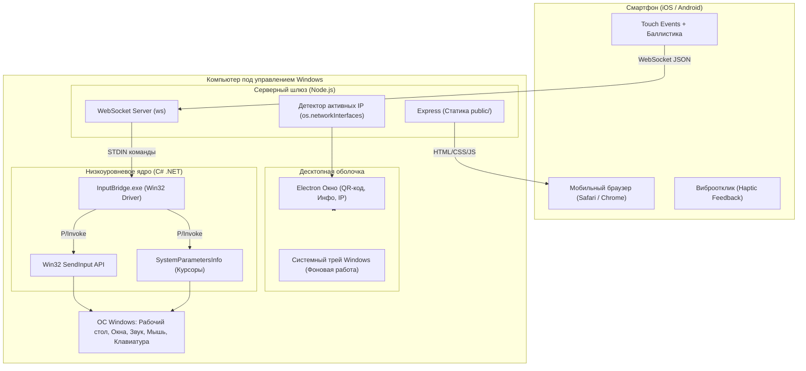

# 📋 Техническое задание (ТЗ) для ИИ-агента: Разработка системы «PC Remote Controller»

> **Назначение документа**: Данный документ является спецификацией для автономного или полуавтономного ИИ-агента (Coding Agent). Он содержит исчерпывающее описание архитектуры, протоколов взаимодействия, низкоуровневых интерфейсов Win32, веб-клиента и критериев приемки для воссоздания или модификации системы.

---

## 1. Концепция и ключевые цели

Разработать легковесный, высокоскоростной программный комплекс под ОС Windows, позволяющий удаленно управлять компьютером с любого смартфона (iOS / Android) через стандартный мобильный браузер по локальной сети Wi-Fi.

### Ключевые архитектурные принципы:
1. **Zero Python**: Отсутствие необходимости в Python, Python-библиотеках (`pyautogui`, `pynput`, `flask` и др.) и сторонних runtime-интерпретаторах.
2. **Zero Native C++ Build Tools**: Отсутствие зависимостей от `node-gyp`, Python для сборки, Visual Studio C++ Build Tools.
3. **Автономность на любой Windows 10/11**: Использование нативного C# файла, компилируемого штатным компилятором Windows `csc.exe` (.NET Framework 4.x), присутствующим во всех современных версиях ОС Windows.
4. **Сверхнизкая задержка (Ultra-low latency)**: Время реакции на сенсорные события и жесты < 5 мс по локальной сети.
5. **Нулевой порог входа для пользователя**: На смартфоне не требуется установка приложений из App Store / Google Play — подключение осуществляется по QR-коду в браузере.

---

## 2. Архитектура системы

Комплекс состоит из четырех взаимосвязанных уровней:



---

## 3. Детальная спецификация модулей

### 3.1. Модуль 1: Нативный драйвер ввода (`native/InputBridge.cs`)
Низкоуровневый исполняемый файл на C# (.NET Framework 4.x), взаимодействующий с Node.js через стандартные потоки ввода-вывода (`stdin`/`stdout`).

- **Автокомпиляция**:
  - Использовать встроенный компилятор: `C:\Windows\Microsoft.NET\Framework64\v4.0.30319\csc.exe`
  - Флаги: `/nologo /optimize /out:native\InputBridge.exe native\InputBridge.cs`
- **Протокол STDIN**:
  - Чтение команд построчно (`Console.ReadLine()`), кодировка `UTF-8`.
  - При запуске отправляет в `stdout` строку: `READY`.
  - Завершение работы по команде `EXIT` или закрытию потока.
- **Поддерживаемые Win32 API функции**:
  - `SendInput` (`user32.dll`) с типами `INPUT_MOUSE` и `INPUT_KEYBOARD`.
  - `SystemParametersInfo` (`SPI_SETCURSORS = 0x0057`) для сброса/восстановления системных указателей.
  - `LoadCursorFromFile` и `SetSystemCursor` для динамической подмены размера курсора без перезагрузки системы.
- **Обработка команд**:
  - `MOVE <dx> <dy>`: относительное перемещение мыши через `MOUSEEVENTF_MOVE`.
  - `CLICK <left|right|middle|double>`: нажатие и отпускание соответствующей кнопки (`MOUSEEVENTF_LEFTDOWN` + `UP`).
  - `MOUSEDOWN <left|right|middle>` / `MOUSEUP <left|right|middle>`: раздельное нажатие/отпускание для реализации Drag & Drop.
  - `SCROLL <deltaY> [deltaX]`: вертикальный (`MOUSEEVENTF_WHEEL`) и горизонтальный (`MOUSEEVENTF_HWHEEL`) скроллинг.
  - `TYPE <unicode_string>`: печать символов через `KEYEVENTF_UNICODE` без переключения системной раскладки Windows (поддержка русского, английского, эмодзи).
  - `KEY <name>`: одиночные клавиши (`ENTER`, `BACKSPACE`, `TAB`, `ESC`, `SPACE`, стрелки, `WIN`, мультимедиа: `VOLUP`, `VOLDOWN`, `MUTE`, `PLAYPAUSE`).
  - Комбинации клавиш (Combos): `CTRLC`, `CTRLV`, `CTRLZ`, `CTRLA`, `ALTTAB`, `WIND`.
  - `CURSOR_SCALE <LARGE|XLARGE|NORMAL>`: подмена системного курсора на большие варианты (`aero_arrow_l.cur` / `aero_arrow_xl.cur` из `C:\Windows\Cursors`).
  - `MAGNIFIER <ON|OFF>`: запуск или завершение `magnify.exe`.
  - Безопасное завершение (`ProcessExit`, `CancelKeyPress`): обязательный вызов `RestoreCursor()` для исключения залипания огромного курсора.

---

### 3.2. Модуль 2: Серверный шлюз (`server.js`)
Серверная часть на базе Node.js, реализующая HTTP-сервер для раздачи веб-интерфейса и WebSocket-сервер для событий реального времени.

- **Сетевой детектор (`getLocalIpAddresses`)**:
  - Сканирование сетевых интерфейсов через `os.networkInterfaces()`.
  - Фильтрация виртуальных адаптеров (исключение/понижение приоритета для `vEthernet`, `WSL`, `VMware`, `VirtualBox`).
  - Приоритет реальным локальным адресам Wi-Fi / Ethernet (`192.168.x.x` и `10.x.x.x`).
- **Генерация подключения**:
  - Генерация QR-кода в формате DataURL через библиотеку `qrcode` для отображения в десктопном GUI.
  - Генерация ASCII QR-кода в терминале (для серверного режима без GUI).
- **Управление дочерним процессом `InputBridge.exe`**:
  - Проверка наличия бинарника; автоматическая сборка при его отсутствии через `execSync(csc)`.
  - Запуск через `spawn` со скрытием окна консоли (`windowsHide: true`).
- **Логика клиентов WebSocket**:
  - Подсчет активных подключений.
  - Автоматическое увеличение курсора до 72px при первом подключении смартфона (`autoCursorScaleOnConnect: true`).
  - Автоматический возврат курсора к 32px при отключении всех клиентов.
  - Рассылка статуса подключений всем клиентам (`broadcast`).

---

### 3.3. Модуль 3: Десктопная оболочка (`main.js`, `desktop/`)
Интерфейс на базе Electron, предоставляющий пользователю мониторинг и управление.

- **Окно приложения**:
  - Фиксированный размер (например, 440x650), безрамочный режим (`frame: false`), кастомный заголовок с кнопками «Свернуть» и «Закрыть».
  - Защита от дубликатов: `app.requestSingleInstanceLock()`.
  - При нажатии «Закрыть» окно не уничтожается, а скрывается в трей (`mainWindow.hide()`).
- **Системный трей (System Tray)**:
  - Иконка в области уведомлений Windows.
  - Контекстное меню:
    - Показать окно приложения.
    - Быстрое переключение курсора (72px / 32px).
    - Включение/отключение экранной лупы.
    - Открыть мобильный интерфейс в браузере ПК.
    - Полный выход (`app.isQuitting = true; app.quit()`).
- **GUI интерфейс (`desktop/index.html`)**:
  - Отображение сгенерированного QR-кода.
  - Поле с адресом `http://<IP>:3000` и кнопки быстрого копирования в буфер обмена и открытия в браузере.
  - Выпадающий список доступных IP-адресов ПК для ручного переключения в сложных сетях.
  - Живой индикатор подключений со счетчиком клиентов.
  - Системные уведомления Windows при подключении устройства.

---

### 3.4. Модуль 4: Сенсорный веб-клиент (`public/`)
Клиентское мобильное Single Page Application (HTML5, Vanilla CSS3, Vanilla JS).

- **Touchpad и алгоритмы сенсорного ввода (`public/app.js`)**:
  - **1 палец (движение)**:
    - Динамическая баллистика: вычисление скорости перемещения `v = sqrt(dx^2 + dy^2) / dt`.
    - Нелинейное ускорение (плавное позиционирование пиксель-в-пиксель при медленном движении и быстрый полет курсора при свайпе).
  - **1 палец (быстрый тап)**:
    - Длительность < 250 мс, суммарное смещение < 12 px: отправка клика ЛКМ (`CLICK left`), виброотклик 25 мс.
  - **1 палец (долгое нажатие / Long-press)**:
    - Удержание > 350 мс без смещения: активация режима **Drag & Drop** (отправка `MOUSEDOWN left`, виброотклик 60 мс, подсветка тачпада, возможность перетаскивания файлов/окон, отпускание `MOUSEUP left` при снятии пальца).
  - **2 пальца (тап)**:
    - Быстрый тап двумя пальцами: клик ПКМ (`CLICK right`), виброотклик 35 мс.
  - **2 пальца (скролл)**:
    - Синхронное перемещение: отправка `SCROLL <dy> <dx>` с инверсией направления (Natural Scrolling).
  - **Полоса быстрой прокрутки (Scroll Strip)**:
    - Выделенная вертикальная зона у правого края экрана для быстрого листания страниц одним пальцем.
  - **Физические экранные кнопки**:
    - Нижние сенсорные кнопки: ЛКМ, СКМ (колесо), ПКМ.
- **Ввод текста и голосовая диктовка**:
  - Невидимое поле ввода `<input id="hiddenInput">`.
  - При нажатии кнопки клавиатуры поле получает фокус, вызывая экранную клавиатуру смартфона.
  - Отправка вводимых символов в реальном времени через событие `input`.
  - Поддержка голосового ввода: штатная кнопка микрофона на клавиатуре iOS/Android транслирует распознанный текст в `hiddenInput`, откуда он мгновенно передается на ПК.
  - Кнопки быстрых клавиш: `Enter`, `Backspace`, `Space`, `Esc`.
- **Панель горячих клавиш и мультимедиа**:
  - Быстрый доступ к `Win`, `Alt+Tab`, `Свернуть окна (Win+D)`, `Ctrl+C`, `Ctrl+V`, `Ctrl+Z`.
  - Мультимедиа-блок: громкость `+` / `-`, выключение звука (`Mute`), `Play/Pause`.
- **Эргономика и дизайн**:
  - Темная тема, стилистика Glassmorphism, акцентные градиенты.
  - Запрет системных жестов браузера (pinch-to-zoom, pull-to-refresh) через `touch-action: none` и `passive: false`.
  - Автоматическое переподключение WebSocket с индикатором состояния (зеленый/желтый/красный).

---

### 3.5. Модуль 5: Бесконсольный лаунчер (`PCRemote.exe` и скрипты)
- **`native/Launcher.cs`**:
  - Исходный код на C# Windows Forms / WinExe.
  - Запускает `electron .` или `node server.js` с параметрами `CreateNoWindow = true` и `UseShellExecute = false`.
  - Компилируется через `csc.exe /target:winexe /out:PCRemote.exe`.
- **`start.vbs`**:
  - Альтернативный запуск через Windows Script Host без консоли: `CreateObject("WScript.Shell").Run "...", 0, False`.

---

## 4. Спецификация WebSocket-протокола

Обмен между клиентом и сервером ведется через WebSocket с использованием легковесных JSON-пакетов:

| Поле `t` (тип) | Дополнительные поля | Назначение |
| :--- | :--- | :--- |
| `m` | `x`: number, `y`: number | Перемещение курсора на относительные координаты (`dx, dy`) |
| `c` | `b`: `'left' \| 'right' \| 'middle' \| 'double'` | Одиночный или двойной клик указанной кнопкой |
| `down` | `b`: `'left' \| 'right' \| 'middle'` | Нажатие кнопки мыши (зажатие для Drag) |
| `up` | `b`: `'left' \| 'right' \| 'middle'` | Отпускание кнопки мыши (Drop) |
| `w` | `y`: number, `x`: number | Прокрутка колеса мыши по вертикали и горизонтали |
| `text` | `text`: string | Ввод строки текста в формате Unicode |
| `key` | `key`: string (`'ENTER'`, `'ALTTAB'`, `'VOLUP'` и др.) | Нажатие функциональной клавиши или системной комбинации |
| `cursor` | `scale`: `'32' \| '72' \| '96' \| 'toggle'` | Установка масштаба курсора мыши |
| `magnifier`| `state`: `'on' \| 'off' \| 'toggle'` | Управление экранной лупой Windows |
| `ping` | — | Keep-alive запрос (ответ сервера: `{"t": "pong"}`) |
| `status` | `cursorLarge`: boolean, `cursorSize`: number, `clientCount`: number | Серверное уведомление о статусе системы |
| `clients` | `count`: number | Серверное уведомление об изменении количества подключений |

---

## 5. Структура проекта

```
remote-desc/
├── assets/
│   └── icon.png                  # Иконка приложения для окна и трея
├── desktop/
│   ├── index.html                # GUI окно Electron (QR, статус, настройки)
│   ├── preload.js                # Preload скрипт (contextBridge)
│   ├── renderer.js               # Логика десктопного интерфейса
│   └── style.css                 # Стили десктопного окна
├── native/
│   ├── InputBridge.cs            # Исходный код C# Win32 драйвера
│   ├── InputBridge.exe           # Скомпилированный бинарник моста ввода
│   └── Launcher.cs               # Исходный код C# лаунчера без консоли
├── public/
│   ├── index.html                # Мобильный веб-интерфейс тачпада
│   ├── app.js                    # Сенсорная логика, жесты, WebSocket клиент
│   └── style.css                 # Мобильные стили (Glassmorphism, Dark UI)
├── main.js                       # Точка входа Electron (окно, трей, IPC)
├── server.js                     # Сервер Node.js (Express, WebSocket, Bridge IPC)
├── PCRemote.exe                  # Главный исполняемый файл запуска без консоли
├── start.bat                     # Скрипт быстрого запуска через npm
├── start.vbs                     # VBS-скрипт скрытого запуска без окна CMD
├── package.json                  # Конфигурация зависимостей и build-скриптов
└── TASK_SPEC.md                  # Данное техническое задание
```

---

## 6. Пошаговый сценарий реализации для ИИ-агента

1. **Шаг 1: Инициализация окружения и зависимостей**
   - Создать `package.json` со скриптами запуска и зависимостями: `express`, `ws`, `qrcode`, `electron`.
2. **Шаг 2: Реализация C# Win32 ядра**
   - Написать `native/InputBridge.cs` с P/Invoke декларациями (`SendInput`, `SystemParametersInfo`, `LoadCursorFromFile`).
   - Настроить сборку через `csc.exe` и проверить реакцию на команды `MOVE`, `CLICK`, `TYPE`, `CURSOR_SCALE`.
3. **Шаг 3: Разработка серверного шлюза**
   - Написать `server.js`: автокомпиляция моста, WebSocket-маршрутизация, автоопределение локальных IP и генерация QR-кода.
4. **Шаг 4: Разработка мобильного SPA**
   - Создать сенсорный интерфейс в `public/`: реализация нелинейного ускорения курсора, жестов тапа/скролла/удержания, скрытого инпута для клавиатуры и голосового ввода.
5. **Шаг 5: Реализация десктопной оболочки Electron**
   - Создать `main.js` и интерфейс в `desktop/`: безрамочное окно, отображение QR-кода, работа в системном трее при закрытии.
6. **Шаг 6: Лаунчер и финальная полировка**
   - Скомпилировать `PCRemote.exe` через `Launcher.cs`.
   - Проверить восстановление стандартного размера курсора при выходе из приложения.

---

## 7. Критерии приемки (Definition of Done)

- [ ] **Запуск**: Двойной клик по `PCRemote.exe` открывает десктопное окно без появления черного окна командной строки.
- [ ] **Подключение**: При наведении камеры смартфона на экранный QR-код открывается веб-тачпад без необходимости установки дополнительного ПО.
- [ ] **Мышь и тачпад**:
  - Плавное перемещение мыши без дерганий и ощутимой задержки (< 5-10 мс).
  - Корректная работа тапов: 1 палец — ЛКМ, 2 пальца — ПКМ.
  - Двухпальцевый скролл работает плавно в обе стороны.
  - Удержание пальца активирует Drag & Drop с виброоткликом.
- [ ] **Ввод текста**: Нажатие кнопки клавиатуры на смартфоне позволяет вводить текст на русском и английском языках, использовать эмодзи и диктовать текст голосом.
- [ ] **Курсор**: При подключении смартфона курсор увеличивается до комфортного для просмотра с дивана размера (72px), а при отключении или выходе из программы — гарантированно возвращается к стандартному (32px).
- [ ] **Фоновый режим**: Закрытие окна сворачивает программу в системный трей возле часов; приложение продолжает работать в фоне.
